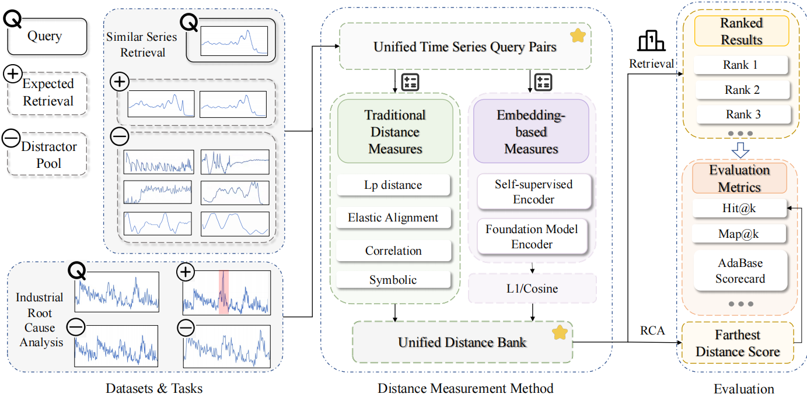

# TSRBench: Benchmarking Time Series Retrieval

[](#installation)
[](#overview)
[](#metrics)
[](#license)

**TSRBench** is an end-to-end benchmark suite for **Time Series Retrieval (TSR)**. It evaluates classical distance-based methods, self-supervised time-series encoders, and time-series foundation-model encoders under a unified query-candidate protocol and a reusable distance-library pipeline.
---

## News

* `[2026-5-30]` Initial release of TSRBench code, UCR-R retrieval scripts, CU-RCA evaluation scripts, and metric recomputation utilities.
* `[2026-4-10]` Public benchmark website: https://adeval.cstcloud.cn/tsr

---

## Overview

Time series retrieval aims to rank candidate time series according to their relevance to a query time series. It is a core primitive for operational analytics, incident triage, similar-pattern search, and root cause diagnosis.

Unlike classification, TSR often involves **multiple relevant targets** for each query. Therefore, a strong benchmark must evaluate not only whether a method retrieves one nearest neighbor, but also whether it retrieves and ranks the broader relevant set.

<p align="center">
  
</p>

<p align="center">
  <b>Figure 1.</b> Overview of TSRBench. 
</p>

TSRBench follows a three-layer design:

1. **Data layer**: constructs query-candidate pools and relevance labels.
2. **Model layer**: computes distances or embedding-space scores and stores them as distance caches.
3. **Evaluation layer**: computes standard retrieval metrics and AdaBase metrics from cached distances.

---

## Benchmark Tasks

### UCR-R: Open Time Series Retrieval

UCR-R is reconstructed from the UCR archive for retrieval-oriented evaluation. Instead of directly treating raw classification labels as retrieval labels, UCR-R defines reconstructed retrieval groups with reviewer-verified morphological consistency.

### CU-RCA: Industrial Incident-Centric Retrieval

CU-RCA is an industrial telecom dataset for incident-centric retrieval. Each incident corresponds to a time window with monitored KPI series. Retrieval is evaluated by whether root-cause-related KPI series are ranked near the top.

---

##  Method

### Classical Distance Methods

* Euclidean distance
* Manhattan distance
* Chebyshev distance
* Modified Euclidean distance
* DTW and modified DTW
* ERP
* EDR
* LCSS
* STS
* DISSIM
* Pearson distance
* SBD
* STI
* SAX
* 1D-SAX
* SFA

### Self-Supervised Encoders

* TS2Vec
* CoST

### Foundation-Model Encoders

Depending on local installation and available checkpoints, TSRBench supports or can be extended to:

* Chronos2
* TimesFM
* Timer
* Sundial
* Time-MoE
* TabPFN
* Moirai, if the corresponding adapter is enabled in your local method registry

---

## Metrics

### Standard Metrics

* `Hit@K`
* `Precision@K`
* `Recall@K`
* `MAP`
* `MAP@K`
* `NDCG@K`

### AdaBase Ranking Scorecard

* `AB-NDCG_log`
* `AB-NDCG_lin`
* `AB-NDCG_exp`
* `AB-MAP_log`
* `AB-MAP_lin`
* `AB-MAP_exp`

---

## Get Started

###  Installation

```bash
pip install -r requirements.txt
```

### Prepare Model Weights

For full experiments with foundation-model encoders, download pretrained models:

```bash
python tools/download_models.py --models all --pretrained_root pretrained_models
```
The TS2Vec checkpoint is already included at:

models/ts2vec/ts2vec/ts2vec_model.pkl

The CoST checkpoint is not included because it is large. If needed, download it from https://github.com/CSTCloudOps/TSRBench/releases/tag/cost_ckpt, place it at:

models/CoST/cost_ckpt/cost_ckpt.pkl
---

### Running TSRBench

### 1. Run UCR-R Retrieval Experiment

```bash
python scripts/run_ucr_r.py 
```

### 2. Run CU-RCA Industrial Retrieval Experiment

```bash
python scripts/run_cu_rca.py
```

### 3. Recompute Metrics From Cache

After running UCR-R once, metrics can be recomputed from cached distances without rerunning retrieval methods:

```bash
python scripts/compute_metrics.py
```

### 4. Extending TSRBench

#### Add a new dataset

Add a loader under `scripts/loaders/`

example:

```python
# scripts/loaders/my_dataset.py

@dataclass
class MyDataset:
    classes: dict

def load_my_dataset(data_dir: str) -> MyDataset:
    # Return a dictionary like {class_id: [series_1, series_2, ...]}.
    return MyDataset(classes={0: [], 1: []})
```

For a new UCR-R-like retrieval experiment, copy `scripts/experiments/ucr_r.py`, replace `load_ucr_r(...)` with `load_my_dataset(...)`, and add a small entry script under `scripts/`, for example `scripts/run_my_dataset.py`.

#### Add a new method

TSRBench supports two method types: classical distance methods and embedding-based methods.

**Classical distance method.** Add the distance function in `methods/distance_methods.py`, then register it in `scripts/distances/registry.py`.

example:

```python
# methods/distance_methods.py
import numpy as np

def my_distance(x, y):
    x = np.asarray(x)
    y = np.asarray(y)
    return float(np.mean(np.abs(x - y)))
```

Register it:

```python
# scripts/distances/registry.py
("MyDistance", dm.my_distance, True),
```

Then run only this method:

```bash
python scripts/run_ucr_r.py --methods MyDistance
```

**Embedding-based method.** Add an embedding precomputation function in `methods/embedding_methods.py`. The function should return an embedding bank:

```python
# methods/embedding_methods.py
import numpy as np

def precompute_myencoder_embeddings(classes, model_path=None, device="cpu"):
    bank = {}
    for class_id, series_list in classes.items():
        for index, series in enumerate(series_list):
            # Replace this with your encoder forward pass.
            embedding = np.asarray([np.mean(series), np.std(series)], dtype=np.float32)
            bank[(class_id, index)] = embedding
    return bank
```

Then call it in `scripts/embeddings/banks.py`:

```python
# scripts/embeddings/banks.py
if _exists(config.myencoder_dir):
    banks["MyEncoder"] = em.precompute_myencoder_embeddings(
        classes,
        model_path=config.myencoder_dir,
        device=config.device,
    )
```

Also add the corresponding field to `EmbeddingConfig` in `scripts/embeddings/banks.py` and pass it from `UCRRConfig` in `scripts/experiments/ucr_r.py` if the method needs a checkpoint or model directory.

Once `banks["MyEncoder"]` exists, `scripts/distances/registry.py` automatically exposes:

```text
MyEncoder_cos
MyEncoder_l2
```

Run it with:

```bash
python scripts/run_ucr_r.py --methods MyEncoder_cos,MyEncoder_l2
```

#### Add a new metric

Add the metric function in `metrics/ranking.py`

example:

```python
# metrics/ranking.py
def top1_label(scores, labels, reverse=False):
    ordered = _ordered_labels(scores, labels, reverse=reverse)
    return float(ordered[0]) if ordered.size else 0.0

def ranking_summary(...):
    ...
    out["top1_label"] = top1_label(scores, labels, reverse=reverse)
    return out
```

After adding a metric, recompute from an existing distance cache:

```bash
python scripts/compute_metrics.py
```
This avoids rerunning retrieval methods.

--- 

## Citation

If you use TSRBench in your research, please cite:

```bibtex

}
```

---

## Contact

For questions, issues, or benchmark contributions, please open a GitHub issue or contact the authors through the project website:

```text
https://adeval.cstcloud.cn/tsr
```

---

## License

The license will be specified in the repository release. Please check `LICENSE` before using the code, datasets, or pretrained artifacts.
